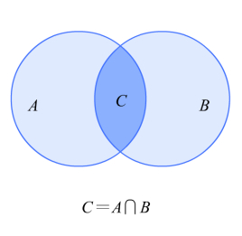

学习typescript的过程并不愉快，太多教程就是官方文档的二手信息贩子，稍稍翻译一下，就来写文章出视频，没有一点点自己的思考，还不如自己去[官网](https://www.typescriptlang.org/docs/handbook/intro.html)机翻。

踩了一些文章和视频的坑后，发现基本都没讲清楚集合的概念。这个被忽略的部分，如果能有一个很好的理解，会减少不小的记忆负担。所以我把自己认为对的理解写下来，另外就是特想吐槽一下ts。

# 集合
`Unions and Intersection Types` 这两个特征是ts能灵活表示各个类型的基石，所以在类型系统中如何理解集合的概念就十分重要了。

首先，在数学名词里union表示并集，intersection表示交集。比如，集合a={1,2,3}, 集合b={2,3,4}。a和b的并集就是{1,2,3,4}，交集是{2,3}。带着这样的想法去看ts里的集合，你会发现，唉，怎么它们反过来了？

`Intersection Types`一般都翻译为交叉类型，用'&'符号连接各个类型，官网有举例 `Person & Serializable & Loggable`，用作多种类型组合为一种(对应的是并集{1,2,3,4})。



a和b的交集c表示为{2,3}，不要绕进去了。

而`Union Types`联合类型，用'|'竖线分隔每个类型，表示一个值可以是几种类型之一(这不得是交集{2,3})。一比对，真的是反过来了吗？

并没有反过来，这只是理解的方向不一致。举个最最简单的例子，一个值可以是string或number，但是一个值能即是string又是number吗？很蓝的啦(变成光，让它具有波粒二象性)，抖个机灵...


不一致的地方在于把类型的属性当成了集合的元素。属性是用来描述一个类型的，属性越多描述越准确，类型所表示的范围就越小，而元素越多，集合越大。举个例子，类型Person有属性name，如果加上属性teach，那么就表示Teacher，如果加上属性study，就表示Student。不知道这个人是学生还是老师,Teacher|Student。为了更精准的描述一个对象，交叉类型'&'要求对象具有更多的属性，集合类型'|'限制了对象可以选择的范围。

**集合类型这一特征，不是去找类型的属性是否相同，而是为了更加精准的描述类型。** 不被数学集合的表象所迷惑，能减轻不少ts高级类型带来的脑力负担。就我而言，掌握了ts集合的思路，再记住几个基本类型，完成日常工作就没啥问题了。然后ts一大堆乱七八糟的东西，我就只想吐槽了。

# 吐槽
typescript并没有用心去设计，而是用户需要什么功能，便'喂'给用户什么功能，导致语言内不少用法相似却又不同。
很多人学完ts就冒出一个问题，interface和type分别在什么情况下用。官方也有给出答案，大概是这样
>* interface创建了新的名字(新的类型) 
>* type不能被extends和implements
>
>使用：尽量使用interface(接口)。联合或元组类型时使用type(类型别名)。

但是不管怎么说，这两者设计本身就具有重合的部分。如果接口这里按照js原型链来设计会不会更好呢。type通过交集和并集的方式，扩大或缩小类型表示范围。interface基于7大原始类型来表示object这一复杂类型。

比如说
```
interface Array {
  index: string
}:array1
``` 
来表示存储字符串的数组array1
或者函数
```
interface Function {
  parameter: [string, string]
  return: array1
}:[func1,func2]
```
表示接受两个字符串的函数func1,func2返回数组array1
整体的思路类似于config文件配置，完整的模板
```
interface Shape {
  properties: basic data type|complex data structures
}:[...variate]
```
如果要对类型进行复用，进行拓展，就可以使用type了，比如
type result = Array | Function ，表示result是Array类型或是Function类型 

---

并不是自己非要逞能，而是ts的设计实在是没有可读性，随着它的发展更像是dsl里的node_modules，简直就是个类型黑洞。尤其是ts用箭头符号=>来表示函数类型，再特么加上重载，读起来跟蝌蚪文似的，可把我给恶心坏了。

从我的实际使用来看，ts学习成本高，收益低，如果不能精简设计，取其精华去其糟粕，实在不值得入手。而从ts的更新来看，明明是附加上去的类型系统，却偏偏做的跟重写了一门语言似的。相当于同时学了python和Java两门语言，运行起来实际却只有javascript一门语言的效果。

为了让别人读懂你的代码，jsdoc它不香吗？有时间再学一门语言搞前端，直接上手Dart它不香吗？

作为一篇typescript心得，typescript该怎么学？建议不学。
